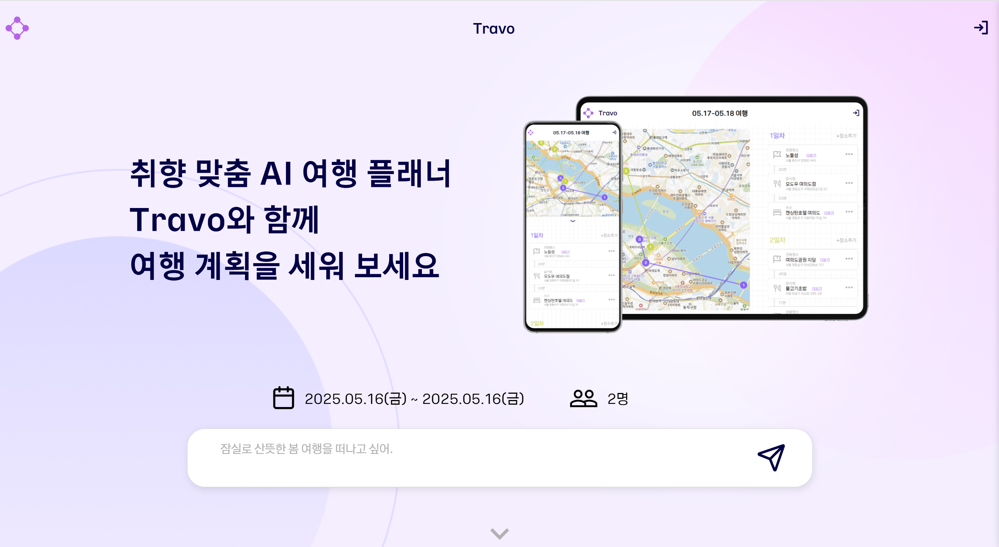
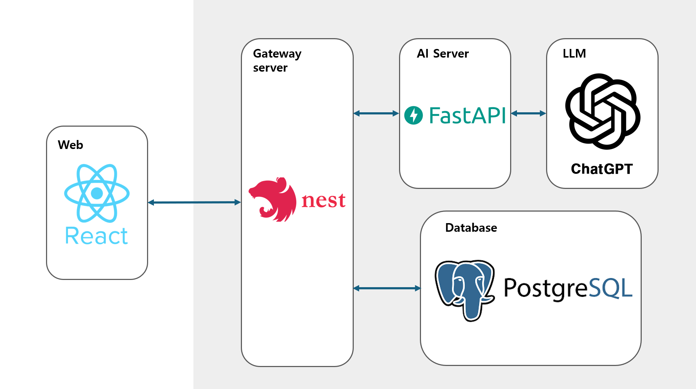

# NE:XT CONTEST

## 0. Introduction

Travo는 여행 계획에 어려움을 느끼는 사용자들을 위한 프롬프트 기반 LLM 여행 계획 추천 서비스입니다. 사용자는 자연어로 여행에 대한 간단한 요구사항만 입력하면, Travo가 맞춤형 일정을 자동으로 구성하여 추천해줍니다.

| **Demo (25. 05. 16.)**                         |
| ---------------------------------------------- |
|  |

> 위 이미지를 클릭하면 데모 영상을 확인할 수 있습니다. 또는 [Travo](https://travo.kr)에 접속하여 직접 사용해보실 수 있습니다.

## 1. Target&Goal

### Target

  </img>
  </img>

여행 계획에 불편함을 겪는 사용자들을 Target으로 하여 기획

### Goal

옵션을 제한적으로 선택하여 여행 계획을 추천 받는 기존 플랫폼들과 비교하여 자유도가 높은 사용자 맞춤형 여행 계획 서비스를 제작하여 여행 계획에 어려움을 겪는 사용자들에게 도움을 주는 것이 목적입니다.

## 2. Key Features

<U>1. prompt 기반 일정 추천 기능</U>

promt를 기반으로 한 여행 계획 추천을 통해 사용자가 원하는 바가 무엇인지 세심하게 맞춰줄 수 있습니다.

<U>2. 일정 저장 기능</U>

prompt를 통해 생성한 일정들은 자동으로 저장되며 언제든 다시 열람할 수 있습니다.

<U>3. 장소 간 이동 시간 표시 기능</U>

일정 생성 이후에 대중교통을 기반으로 한 각 장소별 이동 시간을 표시합니다.

## 3. Architecture

### Tech Stack

- **FrontEnd**: React.js
- **BackEnd**: NestJS
- **AI**: FastAPI, LangChain, OpenAI
- **DB**: PostgreSQL
